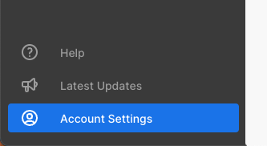
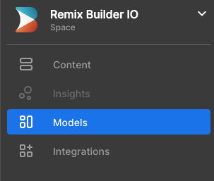
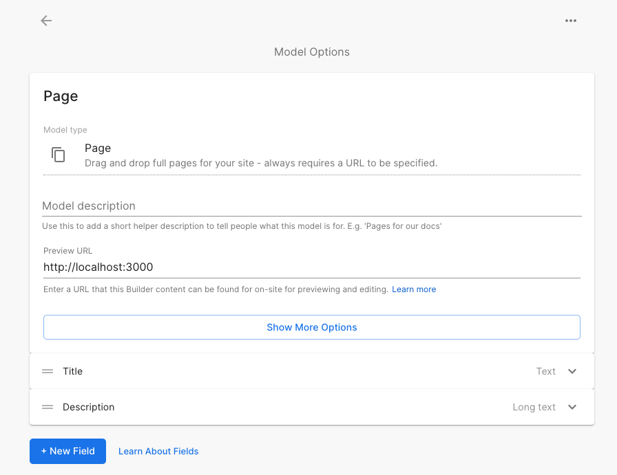
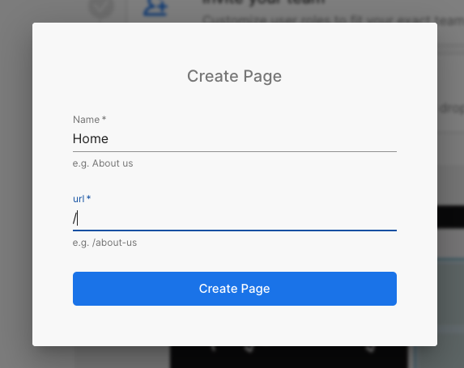
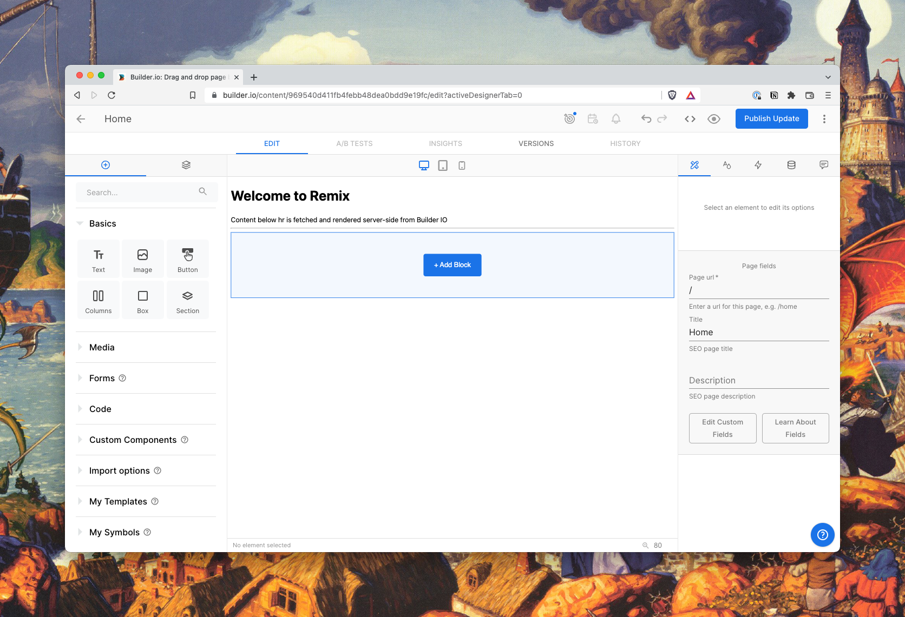

# Welcome to Remix + Builder IO template.

Demo: https://remix-builder-io.vercel.app/

This is a sample application which illustrates how to leverage server-side rendering of CMS content hosted on Builder.io using Remix as a framework.

## Getting it to work

- Go to https://builder.io/account/space (click in Account Settings on bottom left corner)



- Copy your `Public API Key`, create a file named `.env` with `BUILDER_API_KEY={{YOUR_API_KEY_GOES_HERE}}`. PROTIP: in production, you'll have to add this as an environment variable too.

- Go to https://builder.io/models (click in Models on left menu)



- Click on Page

- Add `http://localhost:3000` as a preview URL. PROTIP: you may have to allow the "builder.io" in your browser settings to access HTTP content in an iframe served inside HTTPS. Check this video: https://www.youtube.com/watch?v=YL5gbEmx9Wo



- Create a new page with url `/`. 



- Make sure your dev server is up (`npm run dev`) and edit the page. You should see the "add block" button.



## Deployment

After having run the `create-remix` command and selected "Vercel" as a deployment target, you only need to [import your Git repository](https://vercel.com/new) into Vercel, and it will be deployed.

If you'd like to avoid using a Git repository, you can also deploy the directory by running [Vercel CLI](https://vercel.com/cli):

```sh
npm i -g vercel
vercel
```

It is generally recommended to use a Git repository, because future commits will then automatically be deployed by Vercel, through its [Git Integration](https://vercel.com/docs/concepts/git).

## Development

To run your Remix app locally, make sure your project's local dependencies are installed:

```sh
npm install
```

Afterwards, start the Remix development server like so:

```sh
npm run dev
```

Open up [http://localhost:3000](http://localhost:3000) and you should be ready to go!

If you're used to using the `vercel dev` command provided by [Vercel CLI](https://vercel.com/cli) instead, you can also use that, but it's not needed.
